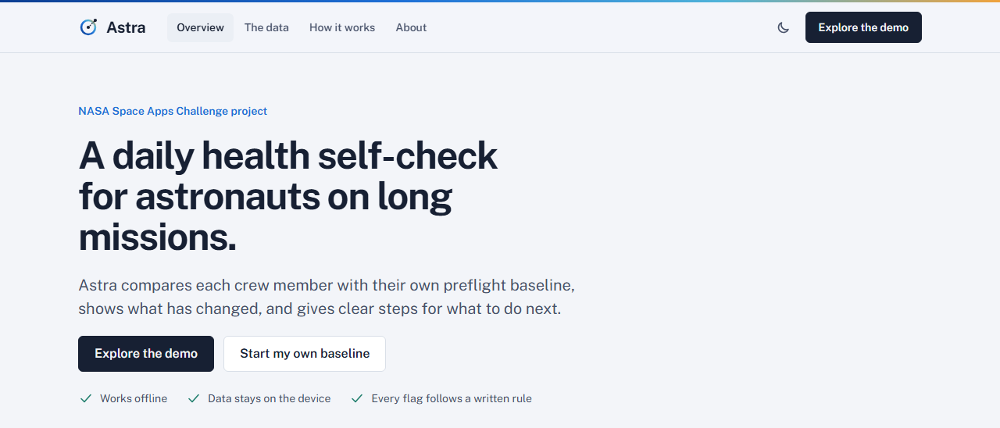
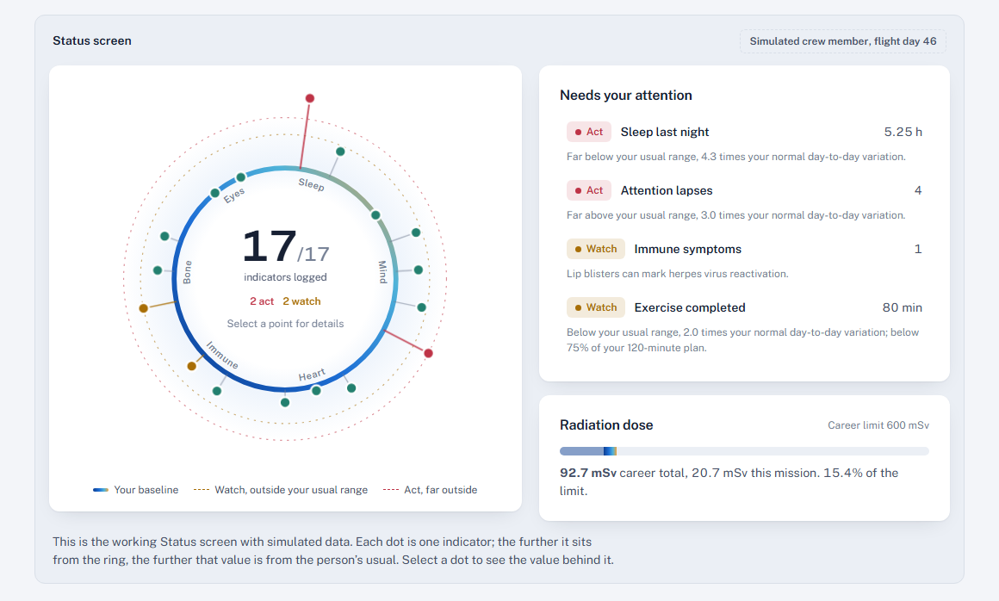
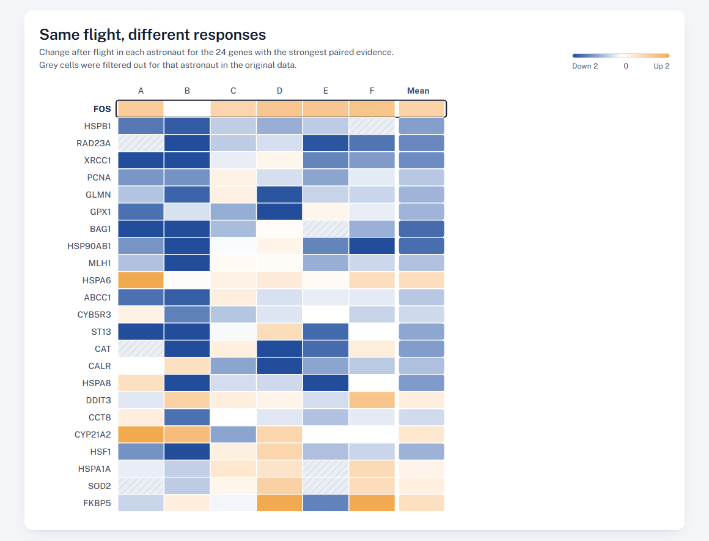

# Astra

**Notice when you drift from your own normal.**

Astra is a daily health self-check for astronauts on long-duration missions. In about two minutes a crew member logs sleep, mood, a 3-minute reaction-time test, resting heart rate, blood pressure, temperature, immune symptoms, exercise, body mass, pain, vision and radiation dose. Astra compares every value with that person's own preflight baseline, shows what has moved, and gives clear on-board steps for what to do next and when to call the flight surgeon.

It was built for the NASA Space Apps Challenge brief on astronaut health self-monitoring, and its design is grounded in NASA GeneLab study **GLDS-53**, *Spaceflight Modulates Gene Expression in Astronauts*.

**Live site: https://mdmusfiqurrahmanakib.github.io/tether/**

The site opens on a project overview. Choose "Explore the demo" to open the app with a simulated crew member on flight day 46, with nothing to install and no account.



| Status, with the baseline ring | The GLDS-53 re-analysis |
| --- | --- |
|  |  |

---

## How Astra answers the challenge

| The brief asks for software that... | Astra |
| --- | --- |
| gathers health indicators | 17 indicators across sleep, mind and mood, heart and circulation, immune signs, bone and muscle, eyes and head, plus personal dosimeter readings. Includes a built-in 3-minute psychomotor vigilance test (PVT-B). |
| covers immune change, bone loss, cardiovascular events and behavioral health | Each risk has its own indicators: immune symptoms and temperature; exercise, body mass and back pain; resting heart rate and blood pressure; mood, stress, connection, reaction time and attention lapses. |
| lets astronauts evaluate their status | The Status view places every indicator on a ring around the person's own baseline. Anything two robust spreads out is marked Watch, three spreads out or three Watch days in a row is marked Act, and hard limits such as fever override the baseline. Each indicator has a three-week trend with the usual range shaded. |
| lets astronauts act on it | The Act view turns each flag into a short checklist written like a crew procedure, ending with a clear rule for when to involve the flight surgeon. |
| works on a long mission | Runs fully offline after first load, keeps all data on the device, and exports to CSV or a backup file for downlink. |

## What the GeneLab data shows, and why it shaped the design

GLDS-53 measured 234 stress-response genes in the whole blood of six Space Shuttle astronauts (four men, two women), ten days before launch (L−10) and two to three hours after landing (R+0) [1, 2].

Astra re-analyses the deposited values pair by pair. The full script is in [`analysis/glds53_analysis.py`](analysis/glds53_analysis.py) and runs on the original files in `analysis/raw/`.

* The deposited per-sample values match the authors' published fold-change table exactly (0 mismatches across all genes and samples).
* 42 genes were measured in at least four astronauts, the authors' own inclusion rule, and were tested.
* Four reach p < 0.05 in a two-sided paired t-test: **FOS** up, and **HSPB1**, **RAD23A** and **XRCC1** down. These overlap with the genes highlighted in the original paper. None survive Benjamini-Hochberg correction for 42 tests (smallest q = 0.20), so they are treated as leads, not proof.
* 21 genes were measured in all six astronauts and changed in every one of them. **Only one, HSPA6, moved in the same direction in all six.** The other 20 rose in some astronauts and fell in others.

That last result is the core design decision. If one flight can push the same pathway up in one astronaut and down in another, a population reference range is the wrong yardstick for self-monitoring. Astra therefore judges every indicator against the crew member's own baseline. The Evidence view in the app shows this with a per-astronaut heat map, a paired slope chart for any gene, a direction-agreement chart and a volcano plot.

## The rule behind every flag

1. **Baseline** is the set of check-ins before launch. If there are fewer than five, the first seven check-ins are used instead.
2. **Usual** is the baseline median. **Spread** is the median absolute deviation × 1.4826, floored at a smallest meaningful change per indicator (for example 3 bpm for heart rate) so a very steady baseline does not turn noise into alarms.
3. Distance from usual is counted only in the direction that matters (short sleep counts, long sleep does not).
4. **Watch** at 2 spreads, **Act** at 3 spreads or after three Watch days in a row.
5. **Hard limits** override the baseline: temperature ≥ 38.0 °C, blood pressure ≥ 140/90 mmHg, two or more immune symptoms on one day, or any new change in near vision.

No machine learning is used. Every flag can be traced to these rules and checked by hand.

## Running it

```bash
npm install
npm run dev        # local development
npm run build      # production build in dist/
npm test           # unit tests for the flag rules
npm run analysis   # regenerate src/data/glds53.json from analysis/raw/
```

The analysis needs Python 3.11 or newer with the package versions in `analysis/requirements.txt`:

```bash
pip install -r analysis/requirements.txt
```

On Windows, where `python3` is usually not on the path, run `python analysis/glds53_analysis.py` instead. Older SciPy releases give a different exact Wilcoxon p-value for two genes, so use the pinned versions to reproduce `glds53.json` exactly.

## Deploying

The app is a static site hosted on GitHub Pages.

Push to `main`, then in Settings, Pages, choose GitHub Actions as the source. The workflow in `.github/workflows/pages.yml` builds with the correct base path for the repository.

## Project layout

```
analysis/                 GLDS-53 re-analysis script, curated gene symbols, raw inputs
src/data/glds53.json      analysis output used by the app
src/lib/baseline.ts       personal baseline and flag rules
src/lib/indicators.ts     indicator definitions, units and hard limits
src/lib/protocols.ts      on-board steps for each indicator
src/components/           baseline ring, sparklines, vigilance test, site header and footer
src/views/                site pages (Home, Evidence, Method, About) and app pages (Status, Check in, Act, Settings)
```

The site pages are open to everyone. The app pages need a profile or the demo data, and fall back to the overview without one.

## Limits

GLDS-53 is six astronauts on short Shuttle flights, one sample before and one after. The after sample was drawn two to three hours after landing, so it mixes the effects of flight with the stress of re-entry and landing. The original raw data were lost to hurricane damage, so only processed values exist, and three astronauts have most genes filtered out. The array covers 234 stress genes, not the whole genome.

Astra does not diagnose and does not replace the flight surgeon. The demo crew member in the app is simulated and labelled as such.

## References

1. Barrila J, Ott CM, LeBlanc C, Mehta SK, Crabbé A, Stafford P, Pierson DL, Nickerson CA. Spaceflight modulates gene expression in the whole blood of astronauts. *npj Microgravity* 2, 16039 (2016). https://doi.org/10.1038/npjmgrav.2016.39
2. NASA Open Science Data Repository. OSD-53 / GLDS-53. https://doi.org/10.25966/qsf7-cr81 (GEO GSE47126, platform GPL140)
3. Barger LK et al. Prevalence of sleep deficiency and use of hypnotic drugs in astronauts before, during, and after spaceflight. *The Lancet Neurology* (2014). https://doi.org/10.1016/S1474-4422(14)70122-X
4. Basner M, Mollicone D, Dinges DF. Validity and sensitivity of a brief psychomotor vigilance test (PVT-B) to total and partial sleep deprivation. *Acta Astronautica* 69, 949–959 (2011). https://doi.org/10.1016/j.actaastro.2011.07.015
5. Crucian B et al. Incidence of clinical symptoms during long-duration orbital spaceflight. *International Journal of General Medicine* 9, 383–391 (2016). https://doi.org/10.2147/IJGM.S114188
6. Mehta SK et al. Latent virus reactivation in astronauts on the International Space Station. *npj Microgravity* (2017). https://doi.org/10.1038/s41526-017-0015-y
7. NASA-STD-3001 Volume 1 Rev B, requirement V1 4030, career effective dose limit of 600 mSv. https://www.nasa.gov/wp-content/uploads/2023/03/radiation-protection-technical-brief-ochmo.pdf

## License

MIT. GLDS-53 data are public NASA open science data.
